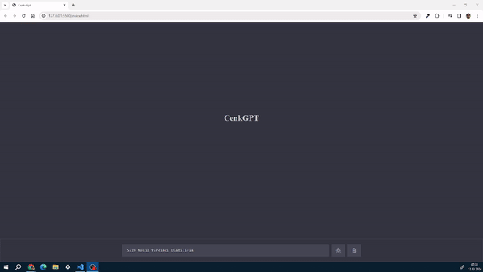

# ChatGPT Klonlama Projesi

Bu proje, OpenAI'nin ChatGPT modelini kullanarak bir sohbet botu klonlamayı amaçlamaktadır. Proje, REST API, HTML5, CSS3 ve Vanilla JavaScript kullanılarak geliştirilmiştir.

## Proje Açıklaması

Bu proje, kullanıcıların ChatGPT modelini kullanarak çeşitli konularda sohbet edebileceği bir web uygulaması geliştirmeyi hedeflemektedir. Kullanıcılar, metin girişi yaparak ChatGPT modeline sorular sorabilir veya sohbet edebilirler. Proje, REST API kullanarak arka planda modelle iletişim kurar ve kullanıcıların isteklerini işler.

## Özellikler

- Kullanıcılar metin girişi yaparak ChatGPT modeline sorular sorabilir veya sohbet edebilirler.
- Arka planda çalışan REST API, kullanıcıların isteklerini işler ve modelle iletişim kurar.
- Basit ve kullanıcı dostu bir arayüz, kullanıcıların rahatça etkileşimde bulunmalarını sağlar.

## Kullanılan Teknolojiler

- **REST API**: Kullanıcı isteklerini işlemek ve modelle iletişim kurmak için kullanılır.
- **HTML5**: Kullanıcı arayüzü oluşturmak için kullanılır.
- **CSS3**: Arayüzün stilini belirlemek için kullanılır.
- **Vanilla JavaScript**: Arayüz ve kullanıcı etkileşimi için kullanılır

